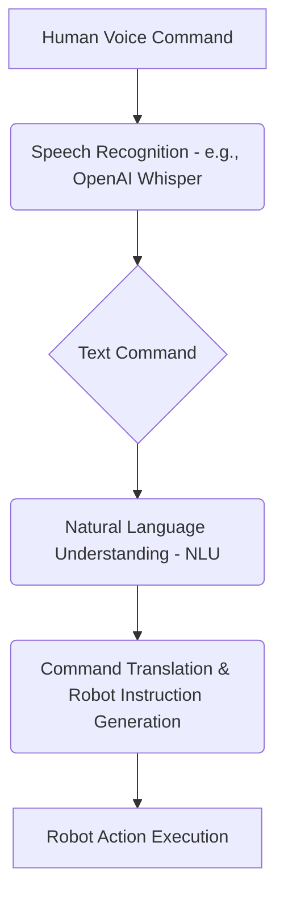

# Lesson 1: Voice-to-Action Systems

In this lesson, we delve into one of the most intuitive forms of human-robot interaction enabled by Vision-Language-Action (VLA): **Voice-to-Action Systems**. These systems allow users to command robots using natural spoken language, significantly enhancing accessibility and ease of use. We'll explore the key components, focusing on Speech Recognition with OpenAI Whisper and the process of converting voice commands into executable robot instructions.

## The Voice-to-Action Pipeline

The journey from a human voice command to a robot's physical action involves several critical steps:



### 1. Speech Recognition with OpenAI Whisper

The first and foundational step is accurately converting spoken words into text. **OpenAI Whisper** is a powerful general-purpose speech recognition model that has demonstrated remarkable performance across various languages and domains.

*   **How Whisper Works**: Whisper is trained on a vast dataset of audio and text, enabling it to transcribe speech with high fidelity, even in challenging acoustic environments. It can handle accents, background noise, and technical jargon surprisingly well.
*   **Role in Voice-to-Action**: Whisper provides the textual input that downstream VLA components will interpret. Its robustness is crucial because errors at this stage can propagate and lead to incorrect robot actions.

    *   **Example ASR Process**:
        1.  **Input**: Audio stream of a human speaking.
        2.  **Whisper Processing**: The audio is fed into the Whisper model.
        3.  **Output**: "Robot, please pick up the blue block."

### 2. Natural Language Understanding (NLU)

Once the voice command is transcribed into text, the system needs to understand its meaning, extract key entities, and identify the user's intent. This is the role of Natural Language Understanding (NLU), often powered by Large Language Models (LLMs).

*   **Intent Recognition**: What does the user want the robot to do? (e.g., "pick up," "move," "clean").
*   **Entity Extraction**: What specific objects or locations are mentioned? (e.g., "blue block," "table," "shelf").
*   **Contextual Analysis**: Understanding the nuances of the command, including potential ambiguities or implicit information.

    *   **Example NLU Process**:
        *   **Text Input**: "Robot, please pick up the blue block."
        *   **NLU Output**:
            *   **Intent**: `PICK_UP`
            *   **Object**: `block`
            *   **Attributes**: `color: blue`
            *   **Target**: `(implied current location)`

### 3. Command Translation & Robot Instruction Generation

The understood command then needs to be translated into a format that the robot can directly execute. This involves mapping the high-level human command to a sequence of low-level robot instructions or API calls.

*   **Action Mapping**: A rule-based system or another LLM translates the NLU output into a robot-specific action plan. This might involve:
    *   **Perception Request**: "Scan for `blue block`."
    *   **Navigation Command**: "Move to `(x, y, z)` of `blue block`."
    *   **Manipulation Sequence**: "Open gripper," "Lower arm," "Close gripper," "Raise arm."
*   **Robot Instruction Format**: These instructions are typically sent to the robot's control system via an API (e.g., ROS 2 actions/services, proprietary robot APIs).

    *   **Flow Diagram (Conceptual for "Pick up blue block")**:
        ```mermaid
        graph LR
            A[NLU Output: PICK_UP(block, blue)] --> B{Robot State Query}
            B --> C{CV: Find blue block (x,y,z)}
            C --> D[Path Planner]
            D --> E[Move Arm to (x,y,z)]
            E --> F[Open Gripper]
            F --> G[Close Gripper]
            G --> H[Raise Arm]
        ```

### 4. Robot Action Execution

Finally, the robot's control system receives these instructions and executes the physical actions. This involves precise motor control, sensor feedback loops, and collision avoidance. The successful execution of these physical actions completes the voice-to-action cycle.

Voice-to-Action systems, powered by advanced AI like OpenAI Whisper and LLMs for NLU and planning, represent a significant leap towards more natural and intuitive human-robot collaboration.
